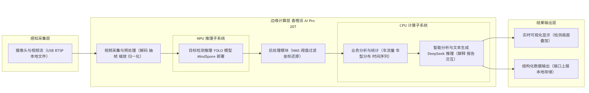
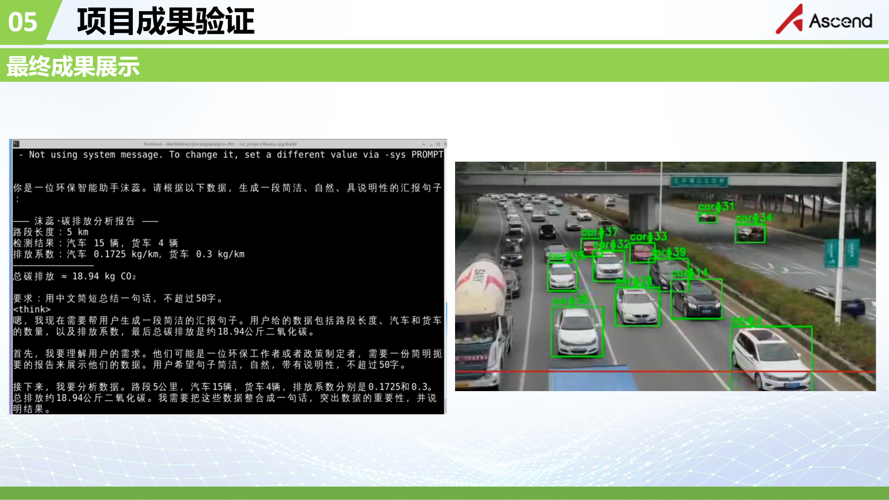
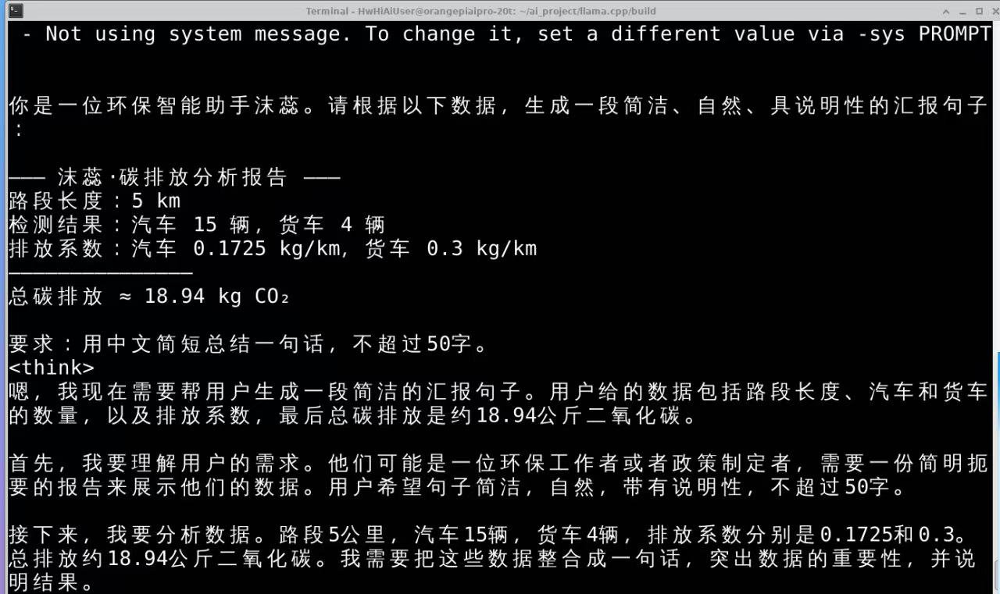

# mindspore-edge-traffic-carbon

基于 MindSpore 的边缘 AI 道路车辆检测与碳排放分析系统，部署于香橙派 AI Pro 20T 等国产边缘 AI 设备。

## 项目简介

本项目为比赛获奖作品，面向道路交通场景，构建了一套基于边缘计算的车辆目标检测与碳排放分析系统。
系统采用“感知采集—边缘计算—业务分析—结果输出”的整体架构，在边缘侧完成车辆检测、车流统计
及智能分析，为交通碳排放精细化核算提供技术参考。

## 系统方案概述

系统整体由视觉感知、边缘计算、业务分析和结果输出等模块组成：

1. **视觉感知层**：基于 YOLO 系列目标检测模型，实现道路车辆的实时识别  
2. **边缘计算层**：基于 MindSpore 框架，在国产边缘 AI 设备上部署推理任务  
3. **业务分析层**：对检测结果进行统计分析，并生成结构化交通数据  
4. **结果输出层**：以可视化画面或结构化数据形式输出分析结果  

## 系统整体架构

## AI 模型与算力分工

考虑到边缘设备资源受限以及不同任务对算力类型的需求差异，系统采用 CPU 与 NPU 的异构计算方式：

- **NPU（神经网络处理单元）**  
  用于执行 YOLO 系列目标检测模型的推理任务，负责道路车辆的实时目标识别，
  以满足边缘侧低功耗、高实时性的应用需求。

- **CPU（通用处理器）**  
  用于完成业务逻辑处理与统计分析，并运行基于 **DeepSeek** 的大语言模型，
  对结构化交通数据进行分析、解释与文本生成。

通过将计算密集型的视觉推理任务与高层语义分析任务进行分离部署，
系统在有限硬件资源条件下实现了实时性、稳定性与可扩展性的平衡。

## 运行效果示例

以下为比赛期间在边缘设备上的实际运行效果示意：

## 使用说明

本项目为比赛结束后的成果归档与展示版本，代码主要用于展示系统设计思路与核心实现逻辑，
未针对不同硬件环境进行完整复现测试，不保证可直接运行。

## 许可证

本项目采用 MIT License。

## 开发说明

本项目在开发与文档整理过程中，使用了自动化工具与人工智能辅助工具进行支持，
项目成员对系统方案与实现逻辑具有完整理解。
